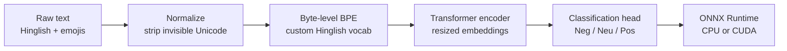

# 🔥 Polyglot's Shorthand: Hinglish Sentiment Engine

**Ultra-efficient sentiment analysis for Romanized, code-mixed Hinglish, with emojis treated as signal, not noise.**

[](https://huggingface.co/v-krishna07/hinglish-models)


> Our solution to **Problem Statement 4: The Polyglot's Shorthand (450 pts)**.
> 📄 Read the technical whitepaper: **[WHITEPAPER.md](WHITEPAPER.md)**

---

## Why this exists

Customer chats, reviews and delivery queries across South Asia rarely arrive in clean English or native scripts. They arrive as **Latinized, code-mixed shorthand**:

| Input | What breaks in standard pipelines | What this project does |
|---|---|---|
| `bhai order cancel krdo please, urgent meeting h` | Indic tokenizers shatter Romanized words; English models see gibberish | A byte-level BPE tokenizer trained on Hinglish keeps `krdo`, `h`, `nhi` compact |
| `kya kar rahe ho` / `kya kr rhe ho` / `kya krre ho` | Phonetic drift produces a different token sequence for the same meaning | In-domain merges plus typo/spelling augmentation give stable representations |
| `Bohot badhiya service` vs `Bohot badhiya service 😒` | Stripping emojis makes praise and complaint identical | Emojis are preserved as tokens and learned as polarity modulators |

Frontier LLMs can read this text, but their cost and latency rule out real-time routing. This project shows that a **compact encoder (under the 500M-parameter budget) served through ONNX Runtime** is the better fit.

## Highlights

- **Emoji-aware normalization**: invisible Unicode (e.g. the U+FE0F variation selector) is stripped; frequent emojis stay intact as tokens.
- **Two deployable models** 
- **ONNX Runtime serving**: CUDA with IO-binding on GPU, dynamic padding on CPU.
- **FastAPI backend + Streamlit demo**, with automatic model download from the Hugging Face Hub.
- **Reproducible benchmarking**: one script produces latency, throughput, accuracy, macro-F1 and tokenizer-fertility tables.

## Models

Weights are hosted on the Hugging Face Hub: **[v-krishna07/hinglish-models](https://huggingface.co/v-krishna07/hinglish-models)**. Small config and tokenizer files live in this repo.

| Variant key | Folder | Format | Role |
|---|---|---|---|
| `fp16` *(default)* | `model_1.0/hinglish_onnx_fp16` | Optimized fp16 ONNX | Newer model, accuracy-oriented, GPU-friendly |
| `onnx` | `model_1.0/hinglish_onnx_model` | fp32 ONNX | Newer model, reference ONNX export |
| n/a | `model_1.0/hinglish_model_checkpoint` | PyTorch `safetensors` | Newer model, for fine-tuning / analysis |
| `fast` | `model_-1.0` | Optimized ONNX | Older model, latency-oriented |


## Architecture



## Quick start

### 1. Install

```bash
git clone https://github.com/v-krishna07/polyglots-shorthand-sentiment.git
cd polyglots-shorthand-sentiment
python3 -m pip install -r requirements.txt
```

### 2. Run the API

```bash
cd model_1.0
python3 -m uvicorn app:app --port 8000
```

If the model folders are not on disk, they are downloaded automatically from the Hugging Face Hub on first run. Choose a variant with an environment variable:

```bash
MODEL_VARIANT=fast python3 -m uvicorn app:app --port 8000   # older, faster model
MODEL_VARIANT=onnx python3 -m uvicorn app:app --port 8000   # newer model, fp16 ONNX
```

### 3. Call it

```bash
curl -X POST http://127.0.0.1:8000/predict \
  -H "Content-Type: application/json" \
  -d '{"text": "Bohot badhiya service 😒"}'
```

Response fields:

```text
text            the original input
sentiment       Negative | Neutral | Positive
confidence      softmax probability of the predicted class (0 to 1)
latency_ms      server-side time: tokenization + inference + softmax
device_used     cpu | cuda
model_variant   fp16 | onnx | fast
```

### 4. Launch the demo UI

In a second terminal:

```bash
cd model_1.0
python3 -m streamlit run webapp.py
```

## Use the models directly

```python
from transformers import AutoTokenizer
from optimum.onnxruntime import ORTModelForSequenceClassification

repo = "v-krishna07/hinglish-models"

# Faster (older) model
tok = AutoTokenizer.from_pretrained(repo, subfolder="model_-1.0")
model = ORTModelForSequenceClassification.from_pretrained(
    repo, subfolder="model_-1.0", file_name="model_optimized.onnx"
)

inputs = tok("bhai order cancel krdo please", return_tensors="pt")
print(model(**inputs).logits.softmax(-1))   # order: Negative, Neutral, Positive
```

For the newer model, use `subfolder="model_1.0/hinglish_onnx_fp16"`. The PyTorch checkpoint loads with `AutoModelForSequenceClassification` and `subfolder="model_1.0/hinglish_model_checkpoint"`.


## Robustness checks

Behaviours the engine is designed to satisfy (probes run automatically by `benchmark.py`):

| Probe | Phenomenon | Expected behaviour |
|---|---|---|
| `kya kar rahe ho` / `kya kr rhe ho` / `kya krre ho` | Phonetic and typo drift | Same prediction across all spellings |
| `bahut badhiya service` / `bht badhiya servis` | Shorthand spelling | Same prediction, similar confidence |
| `Bohot badhiya service` → `... 😒` | Pragmatic emoji flip | Positive → Negative |
| `aap busy ho?` | Intra-sentence English loanword | Handled without degradation |

## Repository structure

```text
.
├── README.md
├── WHITEPAPER.md                 # technical whitepaper
├── requirements.txt
├── benchmark.py                  # latency, throughput, accuracy, fertility
├── upload_models.py              # publishes weights to the Hugging Face Hub
├── inter_iit_csai_ps_4.ipynb     # data prep, tokenizer, training, export
├── model_1.0/                    # newer, more accurate model
│   ├── app.py                    # FastAPI inference service
│   ├── webapp.py                 # Streamlit demo
│   ├── hinglish_model_checkpoint/   # config + tokenizer (weights on the Hub)
│   ├── hinglish_onnx_model/         # config (weights on the Hub)
│   └── hinglish_onnx_fp16/          # config + tokenizer (weights on the Hub)
└── model_-1.0/                   # older, faster model (config + tokenizer; weights on the Hub)
```

## Reproducing training

The end-to-end pipeline lives in [`inter_iit_csai_ps_4.ipynb`](inter_iit_csai_ps_4.ipynb):

1. **Data preparation**: clean text, extract the most frequent emojis.
2. **Tokenizer**: train the byte-level BPE tokenizer on Hinglish text.
3. **Model setup**: load the backbone encoder, resize embeddings to the new vocabulary, add a 3-way classification head.
4. **Fine-tuning**: train with typo and spelling-variation augmentation.
5. **Export and optimization**: export to ONNX, apply graph optimization and fp16 conversion.

## Limitations

- Three-class sentiment only (Negative / Neutral / Positive); intent, summarization and QA are out of scope for this submission.
- Focused on Romanized Hindi-English; other Indic languages in Roman script are not evaluated.
- Sarcasm without an explicit emoji or lexical cue remains the hardest failure mode (see the whitepaper's error analysis).
- Latency figures depend on hardware; always re-run `benchmark.py` on your target machine.

## Roadmap

- float16 quantization.
- Confidence-based cascade: route with the fast model, escalate uncertain cases to the accurate model.
- Multi-task heads (intent classification) on the shared encoder.
- Server-side micro-batching for higher throughput.


## License

`MIT License`

## Acknowledgements

Built on the Hugging Face `transformers`, `tokenizers`, `optimum` and ONNX Runtime ecosystems.